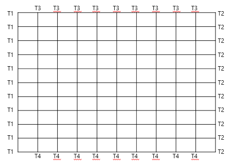
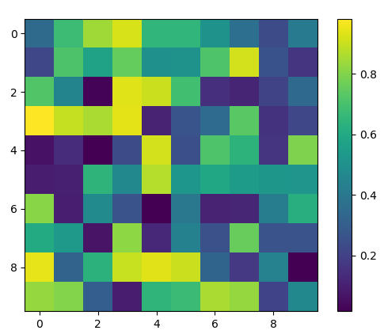

# 중간고사 프로젝트 : 파이썬을 이용하여 행렬 생성 및 연산해보기

1. 온도 변화 시뮬레이션을 위한 선형시스템 생성 
T1, T2, T3, T4는 각자 임의 설정

2. 초기값과 경계값 이용하여 A의 값을 업데이트 -> 이웃 원소들 사이의 값의 최대값이 epsi 값보다 작아질 때 까지. epsi = 0.05
LU decomposition 이용
파이썬 for 문 이용

3. A의 값이 업데이트되는 과정을 colormap으로 그리기

예시 : (명령프롬프트 창에서 pip install matplotlib 필요)
import numpy as np
import matplotlib.pyplot as plt

A=np.random.random((10,10))
plt.imshow(A)
plt.colorbar()
plt.show()

결과 : 

